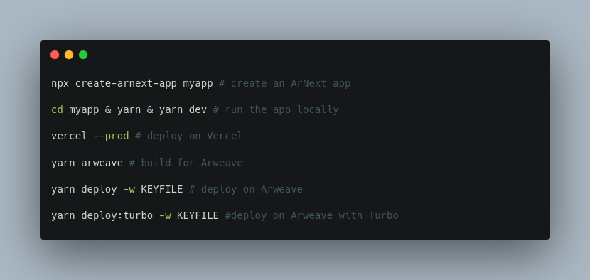

# ArNext



ArNext is a NextJS-based framework that lets you deploy the same codebase both on [Vercel](https://vercel.com) and [Arweave](https://arweave.org).

This allows permaapps to have all kinds of cloud-powered performance optimizations, which were not possible before.

## Limitations of PermaApps

Permaapps are SPAs (single-page applications) deployed on Arweave, which require complete SSG (static site generation) to build the app before deployment. Permaapps traditionally allow only client-side hash routing within the SPA due to the lack of server-side routing.

An example permaapp.

- [https://arweave.net/pnZ34u3byeagp93CCKZtnedhBMPStBMNZO1ieD7a2eg](https://arweave.net/pnZ34u3byeagp93CCKZtnedhBMPStBMNZO1ieD7a2eg)


There are a number of limitations permaapps introduce.

- Loading of dynamic content is very slow due to the lack of SSR (server-side rendering).
- Only the root URL is accessible with client-side hash routing. Regular browser routing without the hash will take you to inaccessible pages when reloading.
- Social media cards don't work for dynamically generated pages. You can have only one card for the root page because dynamically generated meta tags with Javascript are not read by social apps such as X (ex-Twitter).
- No server-side optimizations such as SSR, ISR, and edge CDN are possible.

With these limitations, permaapps cannot practically onboard millions of users.

## What ArNext Does?

An ArNext app is fundamentally a NextJS app, but it also allows the building of an identical permaapp from the same codebase through a series of hacks. It's a **multi-page SPA** (!?) with SSR on Vercel and client-side routing on Arweave.

- You can deploy the identical apps on Vercel and Arweave.
- The permaapps deployed on Arweave function as a censorship-resistant permanent backup.
- The app deployed on Vercel can have all kinds of cloud-powered optimizations.
- The app works as a statically generated multi-page site, but once a page is loaded, it works as a SPA with client-side routing.

### Server-Side Performance Enhancements

Now compare the performance of the permaapp deployed on Vercel below with that of the one deployed on Arweave above.

- [https://arnext-ao.vercel.app](https://arnext-ao.vercel.app)

The one on Vercel is extremely fast with ISR (incremental static regeneration). 

### OpenGraph Tags for Dynamic Pages

Also, the open graph meta tags for dynamically generated pages are enabled with SSR.

- [Social media previews](https://www.opengraph.xyz/url/https%3A%2F%2Farnext-ao.vercel.app%2Fpost%2FsbVCVIVPwMdeYxXgUqe9-rCgr9-JEInUco7EJ_yJ5tI) of [arnext-ao.vercel.app/post/sbVC...](https://arnext-ao.vercel.app/post/sbVCVIVPwMdeYxXgUqe9-rCgr9-JEInUco7EJ_yJ5tI)


### No More Hash Routing

Hash routing is no longer required on Arweave-deployed permaapps.

[https://uz3hpyxn3pe6nifh3xbarjtntxtwcbgd2k2bgdle5vrhqpw23hua.arweave.net/pnZ34u3byeagp93CCKZtnedhBMPStBMNZO1ieD7a2eg/post/sbVCVIVPwMdeYxXgUqe9-rCgr9-JEInUco7EJ_yJ5tI](https://uz3hpyxn3pe6nifh3xbarjtntxtwcbgd2k2bgdle5vrhqpw23hua.arweave.net/pnZ34u3byeagp93CCKZtnedhBMPStBMNZO1ieD7a2eg/post/sbVCVIVPwMdeYxXgUqe9-rCgr9-JEInUco7EJ_yJ5tI)

This was enabled by utilizing `fallback` of [the Arweave Manifests v0.2.0](https://ar-io.github.io/docs/manifests/).

ArNext generates optimized manifests with `fallback` with a modified version of [arkb](https://github.com/textury/arkb).


### Dynamically Generating Relative Paths for Assets

The biggest challenge to building a static permaapp from the NextJS codebase is the static file linking. Arweave gateways deploy permaapps with a subdirectory URL, and you cannot know the subdirectory name before building the app because it's the hash of the built files. NextJS allows `basePath` to build the app for subdirectory deployment, but you cannot use that if you don't know the hash before the build. And `basePath` only allows absolute paths. So we cannot use that.

You need to dynamically calculate and insert relative paths for assets after the app is loaded on a URL, but NextJS doesn't allow such things. In fact, no major web frameworks allow such file linking, for that matter.

There are 3 hacks combined to solve this issue.

- Dynamically calculate the relative path and insert tags in the HTML head ([_document.js](./pages/_document.js))
- Manually rewrite asset tags after building the app code, delete unnecessary html files, and modify the webpack generated js file to produce correct paths during runtime ([arweave.mjs](./arweave.mjs))
- Generate a proper `manifest.json` with modified arkb before deployment ([deploy.js](./arkb/bin/lib/deploy.js))


## How to Build ArNext Apps

### Create ArNext App

```bash
npx create-arnext-app myapp
cd myapp && yarn
yarn dev
```

### Deploy on Vercel

```bash
vercel --prod
```

### Build for Arweave

```bash
yarn arweave
```

Now, the static app to deploy on Arweave is running on [localhost:3000](http://localhost:3000).

### Deploy on Arweave

#### Using arkb

```bash
yarn deploy -w WALLET_PATH
```

#### Using Turbo

Deploying using Turbo requires a wallet funded with [Turbo Credits](https://docs.ardrive.io/docs/turbo/credits/)

```bash
yarn deploy:turbo -w WALLET_PATH
```

A JSON object will be printed to the console with upload information for each file, the arweave manifest generated, and the upload response from uploading the manifest. The manifest id for your deployment can be found at `manifestResponse.id`.

## ArNext Utils

There are a couple of minor changes to make in your NextJS app code to make it work the same on both Vercel and Arweave.

Currently, ArNext only works with the NextJS page router and `react-router-dom` for Arweave.


### Link / useParams / useRouter

Replace `Link`, `useParams`, and `useRouter` with the ones from `arnext`. It will align `next/router` and `react-router-dom`.

```js
import { Link, useParams, useRouter } from "arnext"
...
export default function Post() {
  const router = useRouter() // router.push(pathname)
  const { id } = useParams()
  ...
  return <Link href={`/post/${id}`}>/post/{id}</Link>
}
```

### getStaticProps


Wrap `getStaticProps` with `ssr`.

```js
import { ssr } from "arnext"

export const ssr(getStaticProps({}) {
 ...
  return { props }
})
```
